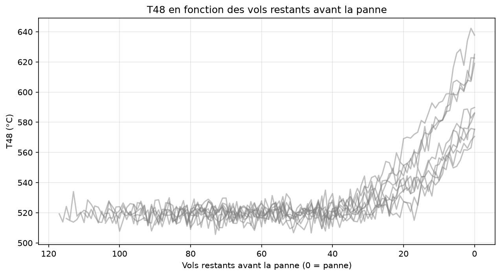
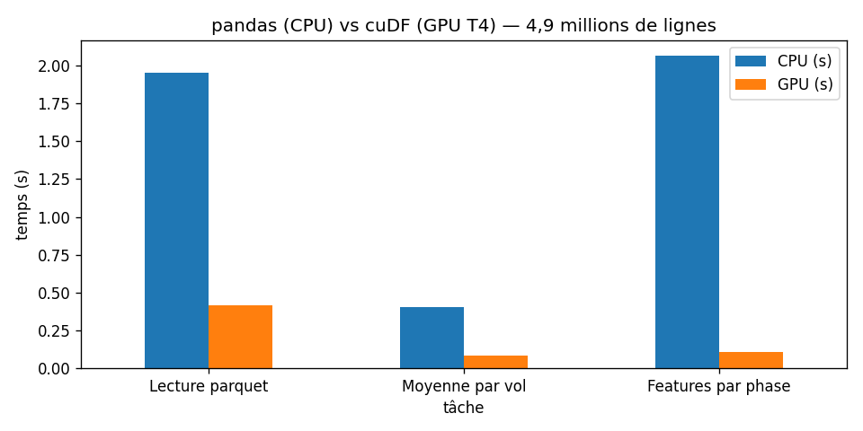

# AeroGuard


Système de détection d'anomalies pour une flotte de moteurs d'avion, construit sur les données NASA N-CMAPSS et accéléré par GPU (NVIDIA RAPIDS, XGBoost, TensorFlow).

## Objectifs

- Détecter le début d'une panne le plus tôt possible
- Identifier le composant touché (fan, compresseur, turbine)
- Repérer les pannes jamais vues à l'entraînement

## Aperçu

Chaque courbe est un moteur : la température T48 reste stable, puis s'emballe dans les 30 à 40 derniers vols avant la panne. L'objectif d'AeroGuard est de repérer ce décollage le plus tôt possible.



## Premiers résultats : baseline par score z (flotte simulée)

Le « normal » est appris sur les vols sains de 5 moteurs ; la détection est testée sur 5 autres moteurs, jamais vus.

| Seuil z | Retard moyen de détection | Avance d'alerte moyenne | Fausses alarmes |
| ------- | ------------------------- | ----------------------- | --------------- |
| 2,5     | 11,4 vols                 | 28,8 vols               | 3               |
| **3**   | **13,4 vols**             | **26,8 vols**           | **1**           |
| 4       | 18,8 vols                 | 21,4 vols               | 0               |

Cette baseline sert de référence : les modèles suivants (XGBoost, autoencodeur) devront détecter l'usure plus tôt.

## ⚡ Accélération GPU (RAPIDS cuDF)

Préparation des données N-CMAPSS DS01 (4,9 millions de lignes), GPU NVIDIA T4 (Google Colab) :

| Tâche | pandas (CPU) | cuDF (GPU) | Gain |
|---|---|---|---|
| Lecture parquet | 1.954 s | 0.413 s | ×4.7 |
| Moyenne par vol | 0.407 s | 0.086 s | ×4.7 |
| Features par phase | 2.065 s | 0.106 s | ×19.5 |



## Structure du projet

```
data/            données brutes et traitées (non versionnées)
notebooks/       exploration et analyses
src/aeroguard/   code réutilisable (détection, simulation)
tests/           tests automatiques (pytest)
results/         graphiques et résultats
docs/            documentation et journal de bord
```

## Installation (Windows)

```bash
python -m venv .venv
.venv\Scripts\Activate.ps1
pip install -r requirements.txt
pip install -e .
```

## Utilisation

```bash
python -m aeroguard.simulation    # générer une flotte simulée
pytest -v                         # lancer les tests
```

## Avec Docker

```bash
docker build -t aeroguard:v0 .
docker run --rm aeroguard:v0              # simulateur
docker run --rm aeroguard:v0 pytest -v    # tests
```

## Technologies

Python · NumPy · pandas · Matplotlib · pytest · Docker · GitHub Actions
Prochainement : NVIDIA RAPIDS · XGBoost · TensorFlow · NVIDIA Triton

## Feuille de route

- [x] **v0 — Fondations** : environnement, détection par score z, simulateur, tests, Docker, CI
- [ ] v1 — Données NASA N-CMAPSS
- [ ] v2 — Baselines et métriques
- [ ] v3 — XGBoost sur GPU
- [ ] v4 — Deep learning (1D-CNN)
- [ ] v5 — Autoencodeur : pannes inconnues
- [ ] v6 — GAN : cas rares
- [ ] v7 — Application complète (Triton, API, dashboard)
