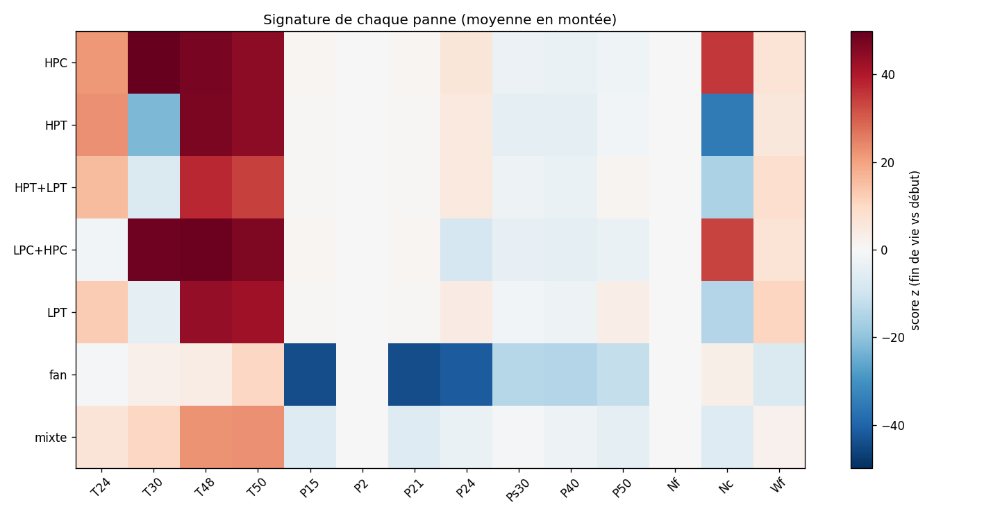

# AeroGuard

[](https://github.com/RayenSansa03/aeroguard/actions/workflows/ci.yml)
[](https://codecov.io/gh/RayenSansa03/aeroguard)
[](https://github.com/astral-sh/ruff)

[](https://github.com/RayenSansa03/aeroguard/network/updates)
Système de détection d'anomalies pour une flotte de moteurs d'avion, construit sur les données NASA N-CMAPSS et accéléré par GPU (NVIDIA RAPIDS, XGBoost, TensorFlow).

## Objectifs

- Détecter le début d'une panne le plus tôt possible
- Identifier le composant touché (fan, compresseur, turbine)
- Repérer les pannes jamais vues à l'entraînement

## Aperçu

Chaque courbe est un moteur : la température T48 reste stable, puis s'emballe dans les 30 à 40 derniers vols avant la panne. L'objectif d'AeroGuard est de repérer ce décollage le plus tôt possible.


## Premiers résultats : baseline par score z (flotte simulée)

Le « normal » est appris sur les vols sains de 5 moteurs ; la détection est testée sur 5 autres moteurs, jamais vus.

| Seuil z | Retard moyen de détection | Avance d'alerte moyenne | Fausses alarmes |
| ------- | ------------------------- | ----------------------- | --------------- |
| 2,5     | 11,4 vols                 | 28,8 vols               | 3               |
| **3**   | **13,4 vols**             | **26,8 vols**           | **1**           |
| 4       | 18,8 vols                 | 21,4 vols               | 0               |

Cette baseline sert de référence : les modèles suivants (XGBoost, autoencodeur) devront détecter l'usure plus tôt.

## ⚡ Accélération GPU (RAPIDS cuDF)

Préparation des données N-CMAPSS DS01 (4,9 millions de lignes), GPU NVIDIA T4 (Google Colab) :

| Tâche              | pandas (CPU) | cuDF (GPU) | Gain  |
| ------------------ | ------------ | ---------- | ----- |
| Lecture parquet    | 1.954 s      | 0.413 s    | ×4.7  |
| Moyenne par vol    | 0.407 s      | 0.086 s    | ×4.7  |
| Features par phase | 2.065 s      | 0.106 s    | ×19.5 |


## ✈️ v1 — Pipeline complet N-CMAPSS

- **9 fichiers NASA** (DS01 à DS08c), **7 familles de panne** (11 modes détaillés), **99 moteurs**, **7 473 vols**
- Une ligne par vol : 126 features (résidus par phase de vol) + étiquettes (hs, RUL, mode et famille de panne)
- Découpage par moteur : 49 train / 11 validation / 39 test, sans fuite, vérifié automatiquement
- 42 tests automatiques (pytest + GitHub Actions)
- DS08d exclu : fichier tronqué dans l'archive officielle NASA (CRC correct, données incomplètes)



**Ce que montrent les signatures :** compresseurs abîmés → T30 et Nc montent ; turbines abîmées → T48/T50 montent et Nc baisse ; fan abîmé → les pressions P15, P21 et P24 chutent.

## 🤖 v2 — Machine learning et métriques

Six modèles comparés sur **11 moteurs de validation jamais vus** à l'entraînement (819 vols). Métrique principale : **F1 macro**, qui juge équitablement les vols sains et les vols usés.

**Par vol**

| Modèle                           | F1 macro  | PR-AUC | Rappel    | Fausses alarmes | Pannes ratées |
| -------------------------------- | --------- | ------ | --------- | --------------- | ------------- |
| **Régression logistique**        | **0,886** | 0,987  | 0,932     | 39              | 39            |
| Random Forest                    | 0,844     | 0,985  | **0,951** | 73              | **28**        |
| KNN                              | 0,763     | 0,903  | 0,843     | 75              | 90            |
| Isolation Forest (non supervisé) | 0,663     | 0,915  | 0,581     | 29              | 241           |
| Modèle naïf (référence)          | 0,412     | 0,702  | 1,000     | 244             | 0             |

**Par moteur** (ce qui compte pour une compagnie aérienne), alerte confirmée sur 3 vols consécutifs

| Modèle                    | Moteurs prévenus | Avance moyenne             | Fausses alarmes |
| ------------------------- | ---------------- | -------------------------- | --------------- |
| **Régression logistique** | **11 / 11**      | **46 vols avant la panne** | **9**           |
| Random Forest             | 11 / 11          | 48 vols                    | 31              |
| Isolation Forest          | 11 / 11          | 25 vols                    | 3               |

**Modèle retenu :** régression logistique avec confirmation sur 3 vols. Elle prévient pour tous les moteurs, environ 46 vols avant la panne, avec 3 fois moins de fausses alarmes que la Random Forest.

**Ce qu'on a appris :**

- Un modèle naïf atteint 70 % d'exactitude sans rien détecter : l'exactitude seule est trompeuse.
- Les features les plus importantes (T48 et T50 en montée) correspondent à la signature physique de l'usure des turbines.
- Le non supervisé (Isolation Forest) prévient tous les moteurs mais tard : c'est la motivation de l'autoencodeur (v5).

Détail de toutes les expériences : [`docs/baselines.md`](docs/baselines.md).

## Structure du projet

```
data/            données brutes et traitées (non versionnées)
notebooks/       exploration et analyses (un notebook par étape)
src/aeroguard/   code réutilisable (package Python)
tests/           tests automatiques (pytest)
results/         graphiques et résultats
docs/            documentation, baselines et journal de bord
```

| Module             | Rôle                                                   |
| ------------------ | ------------------------------------------------------ |
| `simulation.py`    | Flotte simulée (v0)                                    |
| `detection.py`     | Baseline par score z et confirmation des alarmes       |
| `data.py`          | Lecture des fichiers HDF5 N-CMAPSS, étiquettes         |
| `normalisation.py` | Modèle du moteur sain et résidus                       |
| `features.py`      | Phases de vol et 126 features par vol                  |
| `decoupage.py`     | Découpage train / val / test par moteur, sans fuite    |
| `pipeline.py`      | Pipeline complet d'un fichier                          |
| `outils.py`        | Chronométrage                                          |
| `donnees_ml.py`    | Préparation de X / y, poids des classes                |
| `evaluation.py`    | Seuil de décision, métriques, leaderboard              |
| `explication.py`   | Noms de features lisibles, importances                 |
| `anomalies.py`     | Détection non supervisée (score, seuil par percentile) |
| `metier.py`        | Avance d'alerte et fausses alarmes par moteur          |

## Installation (Windows)

```bash
python -m venv .venv
.venv\Scripts\Activate.ps1
pip install -r requirements.txt
pip install -e .
```

## Utilisation

```bash
python -m aeroguard.simulation    # générer une flotte simulée
pytest -v                         # lancer les tests
```

## Avec Docker

```bash
docker build -t aeroguard:v0 .
docker run --rm aeroguard:v0              # simulateur
docker run --rm aeroguard:v0 pytest -v    # tests
```

## Technologies

Python · NumPy · pandas · Matplotlib · scikit-learn · NVIDIA RAPIDS (cuDF) · h5py · pytest · Ruff · pre-commit · Docker · GitHub Actions · Codecov

Prochainement : XGBoost (GPU) · TensorFlow · MLflow · FastAPI · NVIDIA Triton

## Feuille de route

- [x] **v0 — Fondations** : environnement, détection par score z, simulateur, tests, Docker, CI
- [x] **v1 — Données NASA N-CMAPSS** : 9 fichiers, 99 moteurs, 7 473 vols, 126 features, découpage sans fuite
- [x] **v2 — Baselines et métriques** : 6 modèles, F1 macro, métriques métier par moteur
- [ ] v3 — XGBoost sur GPU
- [ ] v4 — Deep learning (1D-CNN)
- [ ] v5 — Autoencodeur : pannes inconnues
- [ ] v6 — GAN : cas rares
- [ ] v7 — Application complète (Triton, API, dashboard)
