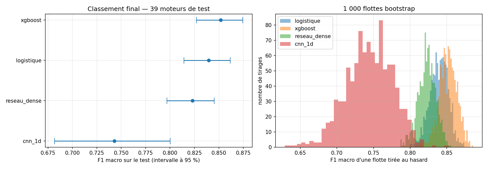
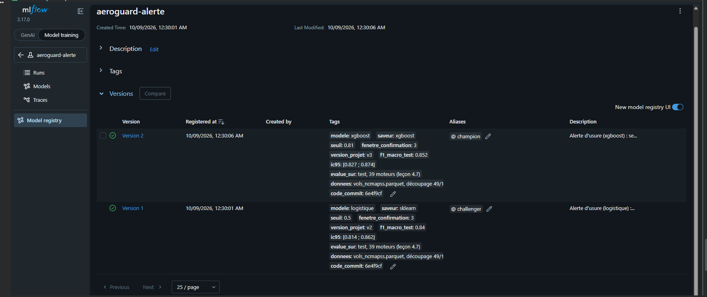
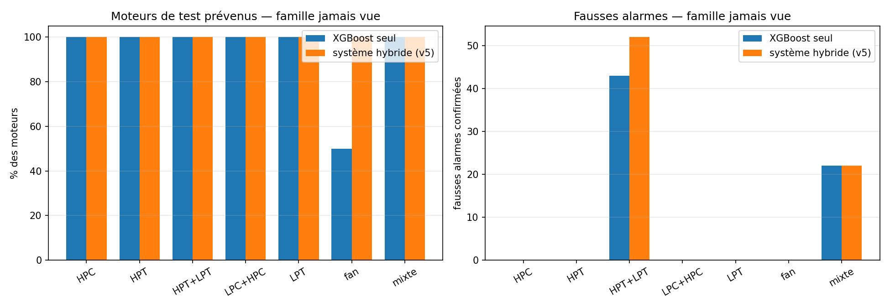
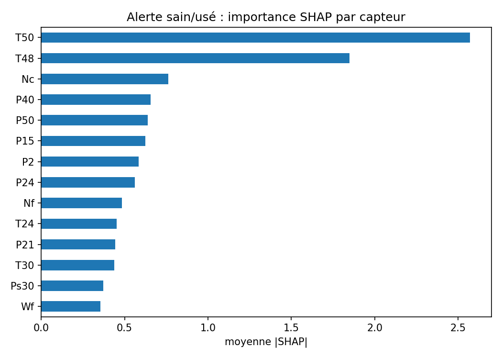
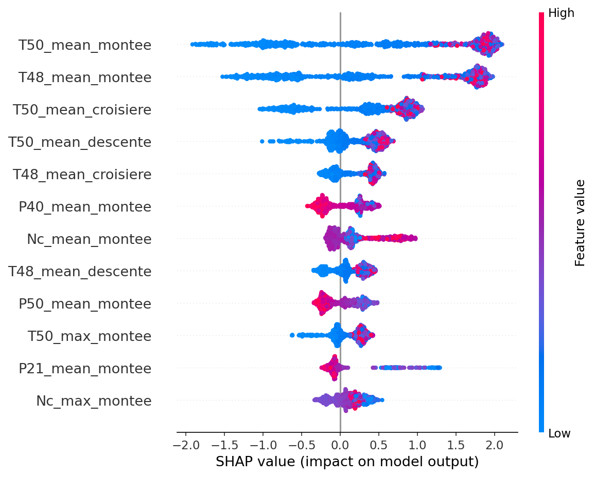
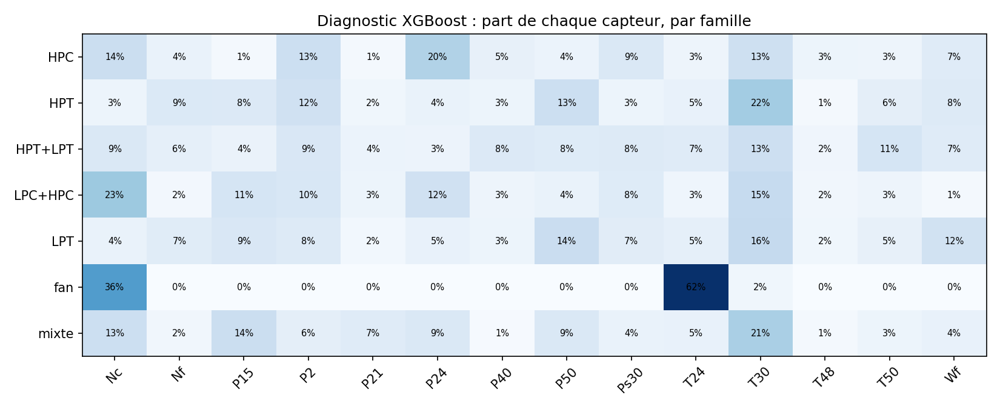

# AeroGuard

[](https://github.com/RayenSansa03/aeroguard/actions/workflows/ci.yml)
[](https://codecov.io/gh/RayenSansa03/aeroguard)
[](https://github.com/astral-sh/ruff)

[](https://github.com/RayenSansa03/aeroguard/network/updates)

Système de détection d'anomalies pour une flotte de moteurs d'avion, construit sur les données NASA N-CMAPSS et accéléré par GPU (NVIDIA RAPIDS, XGBoost, TensorFlow).

## Objectifs

- Détecter le début d'une panne le plus tôt possible
- Identifier le composant touché (fan, compresseur, turbine)
- Repérer les pannes jamais vues à l'entraînement

## Aperçu

Chaque courbe est un moteur : la température T48 reste stable, puis s'emballe dans les 30 à 40 derniers vols avant la panne. L'objectif d'AeroGuard est de repérer ce décollage le plus tôt possible.


## Premiers résultats : baseline par score z (flotte simulée)

Le « normal » est appris sur les vols sains de 5 moteurs ; la détection est testée sur 5 autres moteurs, jamais vus.

| Seuil z | Retard moyen de détection | Avance d'alerte moyenne | Fausses alarmes |
| ------- | ------------------------- | ----------------------- | --------------- |
| 2,5     | 11,4 vols                 | 28,8 vols               | 3               |
| **3**   | **13,4 vols**             | **26,8 vols**           | **1**           |
| 4       | 18,8 vols                 | 21,4 vols               | 0               |

Cette baseline sert de référence : les modèles suivants (XGBoost, autoencodeur) devront détecter l'usure plus tôt.

## ⚡ Accélération GPU (RAPIDS cuDF)

Préparation des données N-CMAPSS DS01 (4,9 millions de lignes), GPU NVIDIA T4 (Google Colab) :

| Tâche              | pandas (CPU) | cuDF (GPU) | Gain  |
| ------------------ | ------------ | ---------- | ----- |
| Lecture parquet    | 1.954 s      | 0.413 s    | ×4.7  |
| Moyenne par vol    | 0.407 s      | 0.086 s    | ×4.7  |
| Features par phase | 2.065 s      | 0.106 s    | ×19.5 |


## ✈️ v1 — Pipeline complet N-CMAPSS

- **9 fichiers NASA** (DS01 à DS08c), **7 familles de panne** (11 modes détaillés), **99 moteurs**, **7 473 vols**
- Une ligne par vol : 126 features (résidus par phase de vol) + étiquettes (hs, RUL, mode et famille de panne)
- Découpage par moteur : 49 train / 11 validation / 39 test, sans fuite, vérifié automatiquement
- 42 tests automatiques (pytest + GitHub Actions)
- DS08d exclu : fichier tronqué dans l'archive officielle NASA (CRC correct, données incomplètes)


**Ce que montrent les signatures :** compresseurs abîmés → T30 et Nc montent ; turbines abîmées → T48/T50 montent et Nc baisse ; fan abîmé → les pressions P15, P21 et P24 chutent.

## 🤖 v2 — Machine learning et métriques

Six modèles comparés sur **11 moteurs de validation jamais vus** à l'entraînement (819 vols). Métrique principale : **F1 macro**, qui juge équitablement les vols sains et les vols usés.

**Par vol**

| Modèle                           | F1 macro  | PR-AUC | Rappel    | Fausses alarmes | Pannes ratées |
| -------------------------------- | --------- | ------ | --------- | --------------- | ------------- |
| **Régression logistique**        | **0,886** | 0,987  | 0,932     | 39              | 39            |
| Random Forest                    | 0,844     | 0,985  | **0,951** | 73              | **28**        |
| KNN                              | 0,763     | 0,903  | 0,843     | 75              | 90            |
| Isolation Forest (non supervisé) | 0,663     | 0,915  | 0,581     | 29              | 241           |
| Modèle naïf (référence)          | 0,412     | 0,702  | 1,000     | 244             | 0             |

**Par moteur** (ce qui compte pour une compagnie aérienne), alerte confirmée sur 3 vols consécutifs

| Modèle                    | Moteurs prévenus | Avance moyenne             | Fausses alarmes |
| ------------------------- | ---------------- | -------------------------- | --------------- |
| **Régression logistique** | **11 / 11**      | **46 vols avant la panne** | **9**           |
| Random Forest             | 11 / 11          | 48 vols                    | 31              |
| Isolation Forest          | 11 / 11          | 25 vols                    | 3               |

**Modèle retenu :** régression logistique avec confirmation sur 3 vols. Elle prévient pour tous les moteurs, environ 46 vols avant la panne, avec 3 fois moins de fausses alarmes que la Random Forest.

**Ce qu'on a appris :**

- Un modèle naïf atteint 70 % d'exactitude sans rien détecter : l'exactitude seule est trompeuse.
- Les features les plus importantes (T48 et T50 en montée) correspondent à la signature physique de l'usure des turbines.
- Le non supervisé (Isolation Forest) prévient tous les moteurs mais tard : c'est la motivation de l'autoencodeur (v5).

Détail de toutes les expériences : [`docs/baselines.md`](docs/baselines.md).

## ⚡ v3 — XGBoost sur GPU

Évaluation finale, une seule fois, sur **39 moteurs de test jamais vus** (réglages figés sur la validation).

**Alerte « ce moteur s'use »** (alerte confirmée sur 3 vols)

| Modèle                           | Moteurs prévenus | Avance moyenne             | Fausses alarmes    |
| -------------------------------- | ---------------- | -------------------------- | ------------------ |
| Régression logistique (v2)       | 39 / 39          | 44,7 vols                  | 54 (12 moteurs)    |
| **XGBoost GPU, seuil 0,81 (v3)** | **39 / 39**      | **40 vols avant la panne** | **28 (4 moteurs)** |

**Diagnostic « quel composant ? »** (7 familles de panne) : 37 moteurs sur 39 bien diagnostiqués par XGBoost, 35 / 39 par la logistique.

**Face à une panne jamais vue** (une famille retirée de l'entraînement) :

- l'alerte détecte encore tous les moteurs pour 6 familles sur 7, mais devient presque aveugle à une panne de fan (2 moteurs sur 4 prévenus) ;
- le diagnostic se trompe alors avec ~90 % de confiance : un modèle supervisé ne sait pas dire « inconnu ». C'est la motivation de l'autoencodeur (v5).

**Vitesse** : sur 371 600 vols, l'entraînement XGBoost est **4,3 fois plus rapide sur GPU** (12 s contre 53 s sur CPU).

## 🧠 v4 — Deep learning (TensorFlow) : réseau dense et CNN 1D

Évaluation finale sur les **39 moteurs de test** (réglages figés sur la validation), avec un intervalle de confiance à 95 % obtenu par **bootstrap sur les moteurs** (1 000 flottes tirées au hasard).

| Modèle                                  | F1 macro [IC 95 %]    | Moteurs prévenus | Avance moyenne | Fausses alarmes    | Prédiction (2 938 vols) |
| --------------------------------------- | --------------------- | ---------------- | -------------- | ------------------ | ----------------------- |
| **XGBoost (v3)**                        | **0,852** [0,83–0,87] | **39 / 39**      | 40,1 vols      | **28 (4 moteurs)** | 0,02 s                  |
| Régression logistique                   | 0,840 [0,81–0,86]     | 39 / 39          | 44,7 vols      | 54 (12 moteurs)    | 0,007 s                 |
| Réseau dense (10 241 poids)             | 0,823 [0,80–0,85]     | 39 / 39          | 41,3 vols      | 51 (11 moteurs)    | 0,08 s                  |
| CNN 1D sur signaux bruts (47 265 poids) | 0,743 [0,68–0,80]     | 37 / 39          | 32,0 vols      | 35 (6 moteurs)     | 3,1 s                   |



- **XGBoost reste le modèle d'alerte.** L'écart avec la logistique n'est pas prouvé (−0,013, intervalle [−0,038 ; +0,011]) ; XGBoost est gardé pour ses fausses alarmes divisées par 2.
- Le réseau dense et le CNN sont **significativement** derrière XGBoost (écarts −0,029 et −0,108, intervalles qui excluent 0).
- Le CNN, qui ne voit que le signal brut, **égale XGBoost sur les pannes de turbine** (HPT+LPT : 0,867 contre 0,857) mais **échoue sur le fan** (0,288 contre 0,777) : la signature du fan est une faible variation de pression, noyée dans les conditions de vol.
- Leçon : avec 49 moteurs d'entraînement, de bonnes features physiques battent le deep learning. Pistes : plus de fenêtres par vol, entrées en résidus.

## 🗂️ MLOps : registre de modèles MLflow

Le modèle d'alerte de production est désigné dans le **registre MLflow** sous le nom `aeroguard-alerte`, et chargé par son alias, jamais par un nom de fichier :

```python
modele = mlflow.xgboost.load_model("models:/aeroguard-alerte@champion")
```

| Version | Alias         | Modèle                | Seuil | F1 macro test [IC 95 %] |
| ------- | ------------- | --------------------- | ----- | ----------------------- |
| 2       | **@champion** | XGBoost (v3)          | 0,81  | 0,852 [0,827 ; 0,874]   |
| 1       | @challenger   | Régression logistique | 0,50  | 0,840 [0,814 ; 0,862]   |



- Chaque version porte sa **notice** : seuil, confirmation sur 3 vols, score et intervalle de confiance du test, données et commit du code (traçabilité).
- **Test de fumée** : le champion rechargé depuis le registre redonne exactement F1 = 0,852 sur le test.
- **Règle de promotion** : un challenger ne devient champion que s'il bat le champion de façon prouvée (bootstrap par moteur). Promotion et retour

## 🛡️ v5 — Autoencodeur et système hybride : détecter les pannes jamais vues

Un modèle supervisé ne reconnaît que les pannes qu'il a apprises : sans aucun moteur fan à l'entraînement, XGBoost ne prévient que **2 moteurs fan de test sur 4**. La v5 ajoute un **autoencodeur** entraîné uniquement sur des vols **sains** : tout ce qu'il reconstruit mal est suspect, quelle que soit la panne.

- **Ligne de base par moteur** : chaque vol est comparé aux 10 premiers vols de **son** moteur, ce qui efface la signature de la flotte (sans elle, l'autoencodeur sonnait en permanence sur une flotte jamais vue).
- **Système hybride** : alerte si XGBoost **ou** l'autoencodeur alerte ; états affichés « normal », « anomalie inconnue », « usure connue », « usure confirmée ».
- **Diagnostic par capteur** : les capteurs les plus mal reconstruits orientent l'inspection (fan → P21, P15 ; turbine HP → T48 ; turbine BP → T50).

**Évaluation finale sur les 39 moteurs de test** (réglages figés sur la validation, après les 10 vols de ligne de base) :

| Système                      | Pannes connues : moteurs prévenus | Avance moyenne | Fausses alarmes | Famille jamais vue : moteurs prévenus  |
| ---------------------------- | --------------------------------- | -------------- | --------------- | -------------------------------------- |
| XGBoost v3 seul              | 39 / 39                           | 40,1 vols      | 26              | 37 / 39 (fan : **2 / 4**)              |
| Autoencodeur + ligne de base | 39 / 39                           | 32,5 vols      | 7               | 39 / 39 (fan : 4 / 4, 0 fausse alarme) |
| **Hybride (v5)**             | **39 / 39**                       | **40,8 vols**  | 29              | **39 / 39 (fan : 4 / 4)**              |



- Sur les pannes connues, l'hybride fait jeu égal avec XGBoost ; sur une panne jamais vue, il prévient **tous** les moteurs.
- Registre MLflow : `aeroguard-alerte@champion` (XGBoost) et `aeroguard-anomalie@champion` (autoencodeur centré) travaillent ensemble.
- **Limite** : sur certaines flottes inconnues (HPT+LPT), les deux gardiens produisent des fausses alarmes ; quelques vols de référence de la nouvelle flotte permettraient de les réduire.
- Essais écartés (documentés) : autoencodeur convolutif sur signaux bruts (7,5 vols d'avance) et « jumeau numérique » (20,2 vols) : les features physiques restent meilleures sur ces données.

## 🔍 Explicabilité : pourquoi le modèle déclenche une alerte (SHAP)

Chaque décision de XGBoost est décomposée capteur par capteur avec SHAP, calculé directement sur GPU (×11,7 plus rapide que sur CPU).

**Ce qui déclenche une alerte** — les températures autour des turbines (T50, T48) pendant la montée dominent, exactement la signature physique d'une turbine usée :



**Le sens de l'effet** — chaque point est un vol ; une température T48/T50 élevée (en rouge) pousse vers « usé » :



**Exemple d'alerte expliquée** — moteur DS01_1, vol 37, 63 vols avant la panne (probabilité 91 %) :
alerte car T50 en montée (+0,77), T50 en croisière (+0,47) et T48 en montée (+0,35).

**Diagnostic du composant** — part de chaque capteur dans la décision, pour chaque famille de panne :



> **Limite identifiée grâce à SHAP :** chaque famille de panne provient d'un seul fichier NASA, et une partie du diagnostic passe par P2 (pression d'entrée), un capteur qui révèle le fichier plutôt que la panne. Le diagnostic reste surtout physique (P24, T30, Nc, T50), mais ses scores sont probablement optimistes pour une flotte nouvelle. Détails dans [`docs/baselines.md`](docs/baselines.md).

## Structure du projet

```
data/            données brutes et traitées (non versionnées)
notebooks/       exploration et analyses (un notebook par étape)
src/aeroguard/   code réutilisable (package Python)
tests/           tests automatiques (pytest)
results/         graphiques et résultats
docs/            documentation, baselines et journal de bord
```

| Module             | Rôle                                                           |
| ------------------ | -------------------------------------------------------------- |
| `simulation.py`    | Flotte simulée (v0)                                            |
| `detection.py`     | Baseline par score z et confirmation des alarmes               |
| `data.py`          | Lecture des fichiers HDF5 N-CMAPSS, étiquettes                 |
| `normalisation.py` | Modèle du moteur sain et résidus                               |
| `features.py`      | Phases de vol et 126 features par vol                          |
| `decoupage.py`     | Découpage train / val / test par moteur, sans fuite            |
| `pipeline.py`      | Pipeline complet d'un fichier                                  |
| `outils.py`        | Chronométrage                                                  |
| `donnees_ml.py`    | Préparation de X / y (alerte et diagnostic), poids des classes |
| `evaluation.py`    | Seuil de décision, métriques, leaderboard                      |
| `explication.py`   | Noms de features lisibles, importances, explications SHAP      |
| `modeles.py`       | XGBoost (GPU), seuil optimal, espace de recherche Optuna       |
| `anomalies.py`     | Détection non supervisée (score, seuil par percentile)         |
| `metier.py`        | Avance d'alerte, fausses alarmes, diagnostic par moteur        |

## Installation (Windows)

```bash
python -m venv .venv
.venv\Scripts\Activate.ps1
pip install -r requirements.txt
pip install -e .
```

## Utilisation

```bash
python -m aeroguard.simulation    # générer une flotte simulée
pytest -v                         # lancer les tests
```

## Avec Docker

```bash
docker build -t aeroguard:v0 .
docker run --rm aeroguard:v0              # simulateur
docker run --rm aeroguard:v0 pytest -v    # tests
```

## Technologies

Python · NumPy · pandas · Matplotlib · scikit-learn · XGBoost (GPU) · Optuna · SHAP · NVIDIA RAPIDS (cuDF) · h5py · pytest · Ruff · pre-commit · Docker · GitHub Actions · Codecov · Dependabot TensorFlow / Keras · MLflow

Prochainement : FastAPI · NVIDIA Triton

## Feuille de route

- [x] **v0 — Fondations** : environnement, détection par score z, simulateur, tests, Docker, CI
- [x] **v1 — Données NASA N-CMAPSS** : 9 fichiers, 99 moteurs, 7 473 vols, 126 features, découpage sans fuite
- [x] **v2 — Baselines et métriques** : 6 modèles, F1 macro, métriques métier par moteur
- [x] **v3 — XGBoost sur GPU** : alerte (39/39 moteurs, 40 vols d'avance), diagnostic du composant (37/39), Optuna, SHAP, test de panne inconnue-
- [x] **v4 — Deep learning** : réseau dense et CNN 1D (TensorFlow), suivi MLflow, comparaison finale par bootstrap : XGBoost reste en tête
- [x] **v5 — Autoencodeur et système hybride** : détection des pannes jamais vues (fan : 4/4 moteurs de test contre 2/4 pour XGBoost seul), ligne de base par moteur, diagnostic par capteur
- [ ] v6 — GAN : cas rares
- [ ] v7 — Application complète (Triton, API, dashboard)
